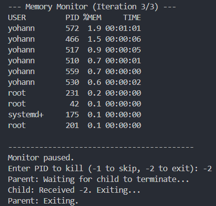

# Operating Systems Assignment-1

## Running Files:
To compile: `g++ monitor.c -o monitor.exe`  
To run: `./monitor.exe`

## Q1)

## Q2) Memory Monitor
> monitor.c

### Functionality
- The user inputs: 
**n**: time in seconds between 2 consecutive prints 
**k**: processes displayed in each print 
**r**: iterations after which a process is killed

- The top **k** processes sorted by %memory usage are listed with their respective users, process identifers and timestamps.

- After running **r** times (every **n** seconds), parent process sends a PID:
`-2 for exit, -1 for skip`.

### Coding
- Created pipes for parent to child and child to parent read/write. Then the parent forks a child process.
- First, the child process *reads from p2c* and *writes to c2p*. Then it runs the **ps** (process status Linux Command): `ps -eo user,pid,%%mem,time --sort=-%%mem | head -n <iters>`
- A temporary grandchild process is used to execute the above command for **r** iterations. After that, it sends a ready signal to parent and either waits to skip the given PID or kills the process.
- The parent process *writes to p2c* and *reads from c2p*. It scans the inputs from the user and sends it to the child.

### Output

## Q3)